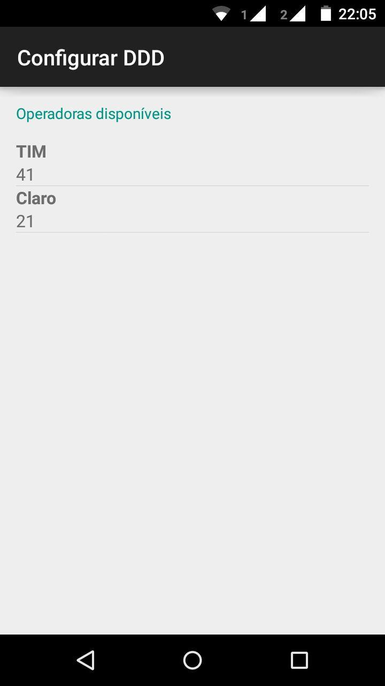
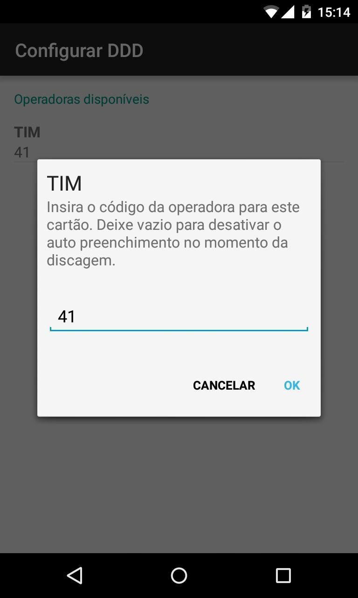

# ConfigurarDdd

Este é um aplicativo dedicado a apenas uma função: Adicionar o código da operadora de celular em seus contatos no momento da discagem.
Desta forma o aplicativo é mais leve, rápido e não pede privilégios que colocam em risco a segurança de seus dados pessoais.

## Características

- Sem cadastro.
- Sem conexão com a internet.
- Simples de configurar.
- Compatível com celulares de dois chips.

## Telas

    
    

